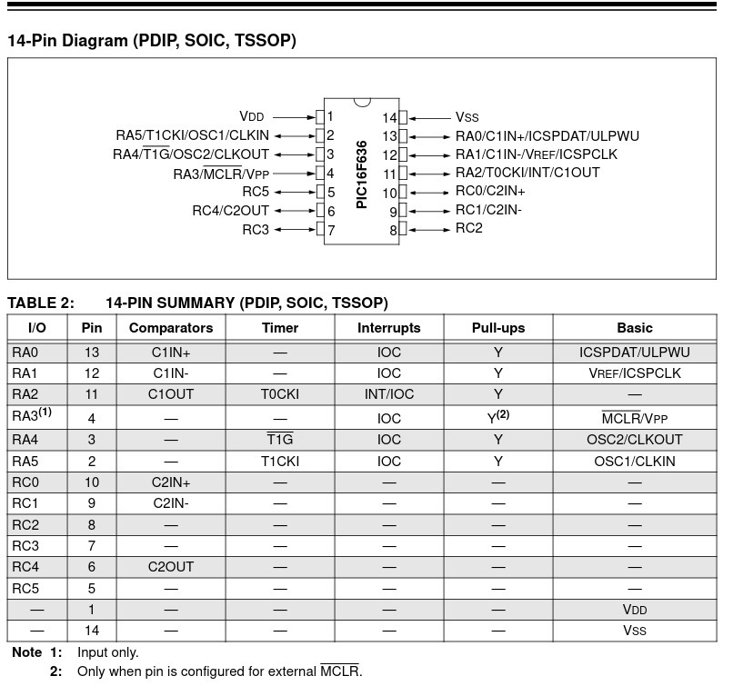

# Pseudo-KeeLoq 433MHz Remote Control System


A highly power-efficient and secure 5-channel RF remote control system utilizing a PIC16F636 microcontroller (Tx) and an Arduino Uno (Rx) over a 433MHz ASK link.

This project implements a custom "Pseudo-KeeLoq" UART-based rolling code protocol to prevent replay attacks, while ensuring nano-ampere power consumption on the transmitter for years of battery life.

## Features
* **5-Channel Output:** Supports up to 5 independent button inputs and receiver outputs.
* **Extreme Low Power (Tx):** Utilizes PIC16F636 sleep mode (nano-ampere standby current), disabling WDT and BOREN to extend a standard 3.7V Li-ion battery life up to 2-5 years without recharging.
* **Anti-Replay Security:** Implements a dynamic rolling counter stored in EEPROM and verified by the receiver, dropping duplicated/replayed packets.
* **Robust UART Transmission:** Modulates data at a stable 1200 bps via bit-banging to ensure high reliability over standard 433MHz ASK/OOK modules.
* **AGC Wake-up Sequence:** Transmits a preamble (0xAA) to stabilize the receiver's Automatic Gain Control before sending the payload.

## Hardware Requirements
### Transmitter (Tx)
* Microcontroller: PIC16F636 (Tested on Revision 5 - Silicon ID: 0x10A5)
* Modulator: 433MHz ASK/OOK Transmitter Module
* Power: 3.7V Li-ion Battery
* Push Buttons: 5x momentary switches (Active-LOW)
* Custom Antenna: 1/4 wave monopole

### Receiver (Rx)
* Microcontroller: Arduino Uno (or any Atmega328P based board)
* Demodulator: 433MHz ASK/OOK Receiver Module
* Output: 5x LEDs or Relays (connected to D2, D3, D4, D5, D6)

## Schematics & Pinout
Please refer to the visual schematics below for the exact wiring routes between the PIC16F636, the push buttons, the RF modulator, and the power source. 


### Reference Documents
* [PIC16F636 Official Datasheet (Microchip)](https://www.microchip.com/wwwproducts/en/PIC16F636)



## Security Architecture (Pseudo-KeeLoq)
The protocol transmits a 6-byte packet structured as follows:
1. DEVICE_ID_HI
2. DEVICE_ID_LO
3. COUNTER_HI
4. COUNTER_LO
5. BUTTON_STATE
6. CHECKSUM (XOR of all previous bytes)

The receiver verifies the checksum, confirms the DEVICE_ID, and checks if the incoming 16-bit COUNTER is strictly greater than the last saved counter in its EEPROM. If the counter is older or equal, the packet is rejected as a replay attack. 
**Note: Always change the DEVICE_ID definitions in the source code to your own secure random values before deployment.**

## Installation & Flashing
### Transmitter (PIC16F636)
Compiled using Microchip XC8 v4.00 on Fedora Linux.
```bash
xc8-cc -mcpu=16f636 -mdfp="path/to/dfp/xc8" -O2 remote.c
```

**Note: Flashing requires a modified ardpicprog host application to bypass strict Device ID revision checks for Rev 5 silicons (ID: 0x10A5). Ensure you use the --erase flag during flashing.
Receiver (Arduino Uno)**

Upload receiver.ino using the standard Arduino IDE. Ensure the SoftwareSerial library is installed.
RF Antenna Fabrication & Fine Tuning

To create a highly optimal 1/4 wave monopole antenna, use copper or brass wire with a diameter of 1.5 mm to 2 mm. While the theoretical length for 433.92 MHz is approximately 17.27 cm, you should prepare the physical length slightly longer, around 17.5 cm to 18 cm, to account for the velocity factor.

During the fine-tuning process without a VNA, observe the RSSI value at the receiver. Cut the main element wire incrementally by 1 mm. Stop cutting once the highest RSSI value or maximum range is achieved. For optimal performance, keep the antenna area clear of metal objects by at least a 1/2 wavelength (~35 cm).